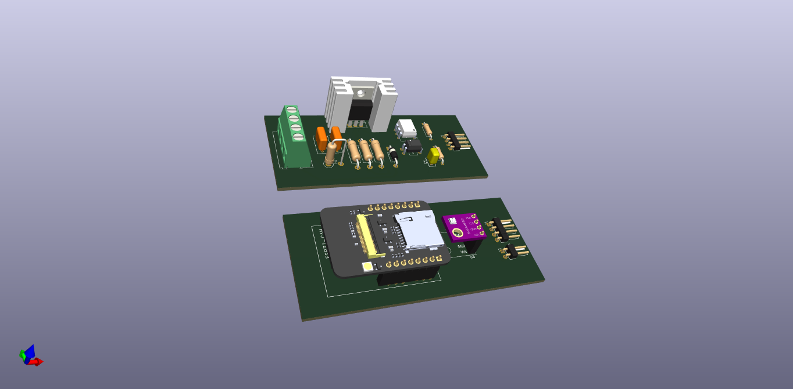

# Sistema de Postes Inteligentes com ESP32CAM

## Objetivo Geral

O sistema de postes inteligentes visa criar uma solução IoT (Internet of Things) que utiliza módulos ESP32CAM instalados em postes para monitoramento, análise de imagem e coleta de dados ambientais. O sistema tem como principais funcionalidades a captura de imagens, o envio dessas imagens via MQTT (usando o servidor Mosquitto) para análise por meio de inteligência artificial (processamento realizado em uma instância na Google Cloud), a leitura de dados ambientais por meio de um sensor BME280, e a capacidade de ajustar a intensidade luminosa dos postes.

### Componentes Principais

1. Módulo Mestre:

    * Responsável por coletar dados ambientais (BME280), capturar imagens e enviar esses dados via MQTT para análise por IA.
    * Envia imagens para processamento em uma instância na Google Cloud para detecção de pessoas.
    * Desempenha o papel do módulo atenuador, controlando a intensidade luminosa dos postes associados (em desenvolvimento).
    * Cada módulo mestre está associado a cada conjunto de 3 postes.
    * Abaixo está o 3D de como deve ficar o módulo mestre, a ideia inicial é que essas duas placas fiquem empilhadas.

    

2. Módulo Atenuador (ESP32 com Dimmer):

    * O módulo atenuador é composto apenas por um dimmer e uma ESP32.
    * Responsável por ajustar a intensidade luminosa dos postes que não possuem o módulo mestre.
    * Recebe informações de controle de intensidade luminosa dos módulos mestres e ajusta a luminosidade de acordo.
    * Abaixo está o 3D de como deve ficar o módulo.

    

3. Servidor MQTT (Mosquitto - AWS):

    Hospeda um servidor Mosquitto MQTT em uma instância da AWS.
    Gerencia a comunicação entre os módulos e o sistema em nuvem.

4. Análise de Imagem com IA (Google Cloud):

    * Processa as imagens capturadas pelos módulos mestres utilizando inteligência artificial.
    * Foco na detecção de pessoas nas imagens.

### Fluxo de Funcionamento

1. Captura de Imagens e Dados Ambientais:

    * O módulo mestre (ESP32CAM) captura imagens periodicamente.
    * Os dados ambientais (temperatura, pressão, altitude, umidade) são lidos pelo sensor BME280.

2. Envio para o Servidor MQTT:

    * As imagens e dados ambientais são enviados para um servidor MQTT hospedado na AWS.
    * O servidor MQTT gerencia a comunicação entre os módulos e o sistema em nuvem.

3. Análise de Imagem por IA (Posterior):

    * As imagens enviadas para o servidor MQTT podem ser processadas posteriormente por um sistema de inteligência artificial.
    * O foco é na detecção de pessoas nas imagens capturadas.

4. Controle de Intensidade Luminosa (Em Desenvolvimento):

    * O módulo mestre também tem a funcionalidade de atuar como um módulo atenuador, controlando a intensidade luminosa dos postes.
    * Essa parte do sistema está em desenvolvimento.
